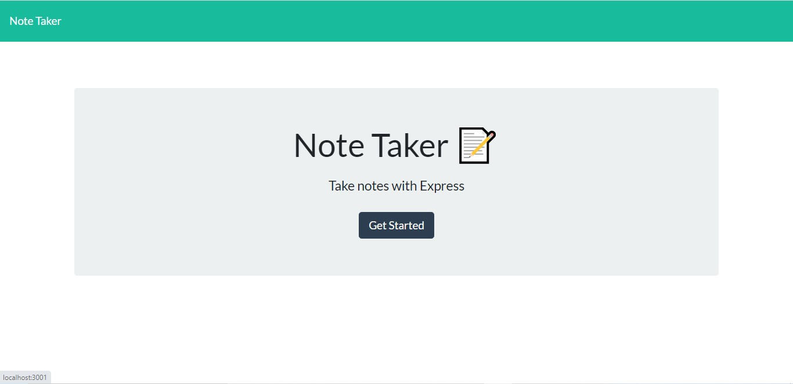
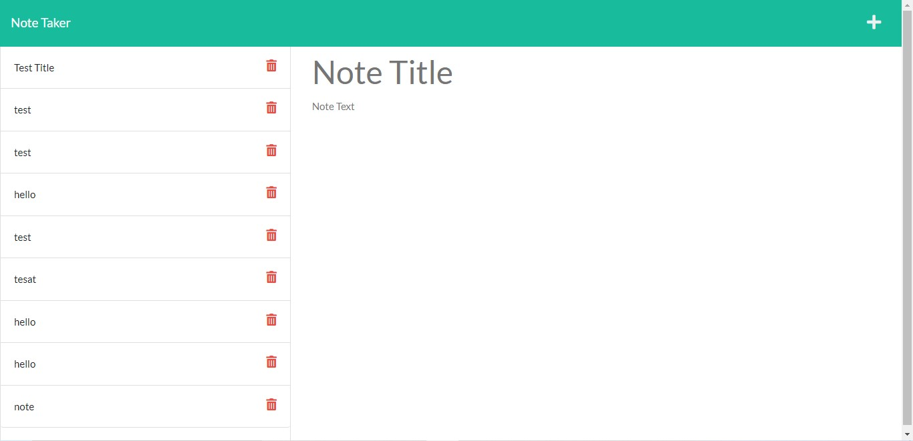

# Note Taker

## Description
For this assignment, the task was to build back end routes for a note taking app that allows users to enter a title and text for a note, and is then saved as part of a JSON file. The contents of the database are presented on the left-hand column, and clicking them brings up the original note.

## Installation
To install the required dependecies type the following command: npm install

